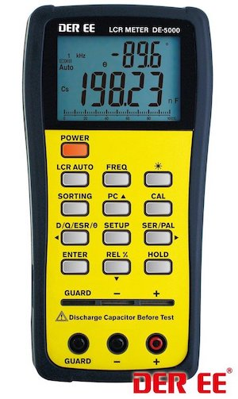

# Python Library for DER EE DE-5000 LCR Meter

Python library for reading data from the DER EE DE-5000 LCR meter.




## Prerequisites

### Installing Python3:

- Debian/Ubuntu

	```
	$ sudo apt-get install python3 python3-pip
	```
- macOS with HomeBrew (tested on macOS 10.14 Mojave)  
	Install [HomeBrew](https://brew.sh/index_de):

	```
	$ /bin/bash -c "$(curl -fsSL https://raw.githubusercontent.com/Homebrew/install/HEAD/install.sh)"
	```

	Install Python3:

	```
	$ brew install python3
	```

### Installing Python package pySerial:

see [pySerial Docs](https://pyserial.readthedocs.io/en/latest/pyserial.html#installation)

- Debian/Ubuntu

	```
	$ sudo apt-get install python3-serial
	```
- macOS

	```
	$ python3 -m pip install pyserial
	```


## Connecting to the DE-5000

The LCR meter transmits data via its IR port. You'll either need the original IR-to-USB Adapter or build your own.


## Running the script

The ```de5000_reader.py``` script is run from command line using the following command:

```
$ python de5000_reader.py [COM_PORT]
```

where ```[COM_PORT]``` is the name of serial port where your IR receiver is connected.  
Linux: e.g. ```/dev/ttyUSB0```, ```/dev/ttyUSB1```, ...  
Windows: e.g. ```COM1```, ```COM2```, ...  


## Output examples

```
2022-05-01 15:55:27.372845
Frequency: 1 KHz
LCR AUTO
AUTO RNG
Primary:   Cs    = 6.4730 uF
Secondary: D     = 0.0864 
```

```
2022-05-01 15:57:53.559141
Frequency: 100 KHz
AUTO RNG
Primary:   Ls    = 48.2600 uH
Secondary: Q     = 21.1200 
```

```
2022-05-01 16:18:38.510388
Frequency: 120 Hz
AUTO RNG
Primary:   Rs    = 0.1900 Ohm
```

```
2022-05-01 16:22:47.329857
Frequency: 100 Hz
Primary:   Cp    = 5.4470 mF
Secondary: Theta = -85.2000 deg
```

```
2022-05-01 16:25:24.567118
Frequency: DC
Primary:   DCR   = 50.2200 Ohm
```


## Links

1. [DER EE DE-5000 page in sigrok Wiki](https://sigrok.org/wiki/DER_EE_DE-5000)
2. [DER EE DE-5000 datasheet](http://www.ietlabs.com/pdf/Datasheets/DE_5000.pdf)
3. [DER EE DE-5000 protocol](protocol.md)
4. [Original Python Library by 4X1MD](https://github.com/4x1md/de5000_lcr_py)
